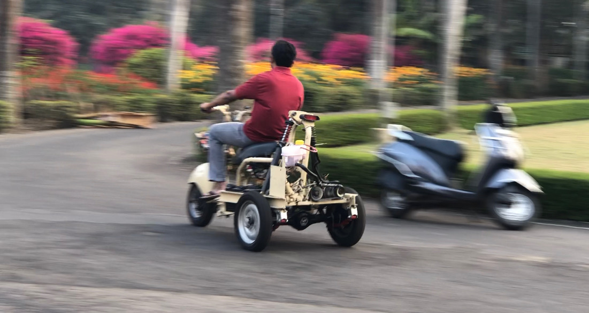

## Jigneshsinh Sindha

Hii. I will share myself on this pages. We have a short time and lot to cover, so I will keep things minimal and simple.

I am passionate Engineer and aligning my efforts to sustainable developments around, may it be in terms of lifestyle, products or cultures. I love disgning things that are simple, reliable and with excellent functionality.

I have guided many young engineers, particularly during their UG course to undertake ambitious projects. Learning my doing was the motto and we have delieverd in some interesting projects.
Here are some highlights on the project:
1. IGVC
2. Eklavya
3. Car project at CHARUSAT
4. Active Tilt Controlle 3W

| Sr No          | Description    | Video Link |
| :------------- | :------------- |------------|
| 1              | oil hydraulic and Pneumatics| [https://youtu.be/FBeMAsuGRtE](https://youtu.be/FBeMAsuGRtE) |

Here is my passion: a safe and green mobility alternate for daily commuting.


Bringing the ideas to reality:
<iframe width="560" height="315" src="https://www.youtube.com/embed/-VjmnLb2v14" title="YouTube video player" frameborder="0" allow="accelerometer; autoplay; clipboard-write; encrypted-media; gyroscope; picture-in-picture" allowfullscreen></iframe>
1. Sindha, J., Chakraborty, B., and Chakravarty, D. (April 30, 2020). "System Identification and Lateral Dynamics of the Active Tilt-Controlled Electric Three Wheeler." ASME. J. Dyn. Sys., Meas., Control. September 2020; 142(9): 091001. https://doi.org/10.1115/1.4046798

My publications:

<span class="__dimensions_badge_embed__" data-doi="10.1001/jama.2016.9797"></span><script async src="https://badge.dimensions.ai/badge.js" charset="utf-8"></script>
\\from the source "https://badge.dimensions.ai/#build"

Video Series from the lectures(Updation in progress):
<style type="text/css">
.tg  {border-collapse:collapse;border-spacing:0;}
.tg td{border-color:black;border-style:solid;border-width:1px;font-family:Arial, sans-serif;font-size:14px;
  overflow:hidden;padding:10px 5px;word-break:normal;}
.tg th{border-color:black;border-style:solid;border-width:1px;font-family:Arial, sans-serif;font-size:14px;
  font-weight:normal;overflow:hidden;padding:10px 5px;word-break:normal;}
.tg .tg-0lax{text-align:left;vertical-align:top}
</style>
<table class="tg">
<thead>
  <tr>
    <th class="tg-0lax">Subject</th>
    <th class="tg-0lax">Video Link</th>
    <th class="tg-0lax">Description</th>
  </tr>
</thead>
<tbody>
  <tr>
    <td class="tg-0lax">OHP</td>
    <td class="tg-0lax">[https://youtu.be/A-MYsQLmH0g](https://youtu.be/A-MYsQLmH0g)</td>
    <td class="tg-0lax">Hello&nbsp;&nbsp;&nbsp;Friends. This is the last session for the OHP subject that we have discussed&nbsp;&nbsp;&nbsp;in the last 32 lectures. We will discuss the trade-off in pipe selection for&nbsp;&nbsp;&nbsp;hydraulic machines. Later, we will revise the chapter on circuit design with&nbsp;&nbsp;&nbsp;a futuristic perspective. Best luck, best wishes. </td>
  </tr>
  <tr>
    <td class="tg-0lax">OHP</td>
    <td class="tg-0lax">[https://youtu.be/umW3DQPoo_Q](https://youtu.be/umW3DQPoo_Q)</td>
    <td class="tg-0lax">Pressure&nbsp;&nbsp;&nbsp;losses in hydraulic circuits. </td>
  </tr>
  <tr>
    <td class="tg-0lax">OHP</td>
    <td class="tg-0lax">[https://youtu.be/PjVwmVdYhcE](https://youtu.be/PjVwmVdYhcE)</td>
    <td class="tg-0lax">Circuits&nbsp;&nbsp;&nbsp;with limit switches-graphical representation</td>
  </tr>
  <tr>
    <td class="tg-0lax">OHP</td>
    <td class="tg-0lax"><a href="https://youtu.be/uXZaWeH9A_M"><span style="text-decoration:none;color:red">https://youtu.be/uXZaWeH9A_M</span></a></td>
    <td class="tg-0lax">We&nbsp;&nbsp;&nbsp;will learn 'Literal' and "Graphical' representation for the circuits&nbsp;&nbsp;&nbsp;used in automatic operation cycles. </td>
  </tr>
</tbody>
</table>


You can use the [editor on GitHub](https://github.com/Jigs86/Jigs86.github.io/edit/main/index.md) to maintain and preview the content for your website in Markdown files.

Whenever you commit to this repository, GitHub Pages will run [Jekyll](https://jekyllrb.com/) to rebuild the pages in your site, from the content in your Markdown files.

### Markdown

Markdown is a lightweight and easy-to-use syntax for styling your writing. It includes conventions for

```markdown
Syntax highlighted code block

# Header 1 (About me)
## Header 2 ()
### Header 3
Education
- Bulleted
- List
My publications
1. Numbered
2. List

**Bold** and _Italic_ and `Code` text

[Link](url) and 
```

For more details see [GitHub Flavored Markdown](https://guides.github.com/features/mastering-markdown/).

### Jekyll Themes

Your Pages site will use the layout and styles from the Jekyll theme you have selected in your [repository settings](https://github.com/Jigs86/Jigs86.github.io/settings). The name of this theme is saved in the Jekyll `_config.yml` configuration file.

### Support or Contact

Having trouble with Pages? Check out our [documentation](https://docs.github.com/categories/github-pages-basics/) or [contact support](https://support.github.com/contact) and we’ll help you sort it out.
